

# 🎮 콘솔 게임 프로젝트
## 제목 - Dungeon Life
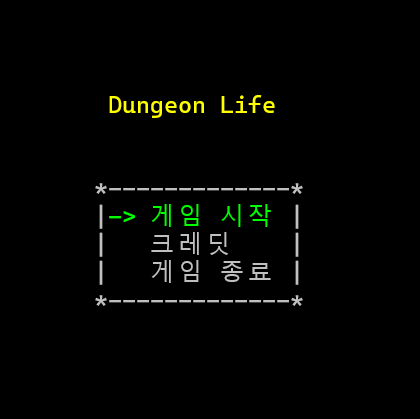
 

## 조작 방법
- 이동 : `↑` `↓` `←` `→`
- 선택 : `Enter`
- 인벤토리 : `I`

 

## 게임 방식
- 던전에서 턴제 전투를 수행하며 골드를 최대한 많이 모으는 방식의 게임이다.
- 체력이 모두 소모될 때까지 전투를 반복하며, 전투 결과에 따라 보상 또는 페널티가 적용된다.

 

## 게임 구성
### 🩷 포션
- 포션을 획득하면 인벤토리에 들어간다.  
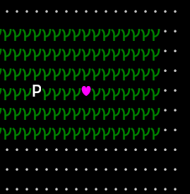
- 인벤토리에서 포션을 사용하면 플레이어의 ♥가 1 회복된다.  
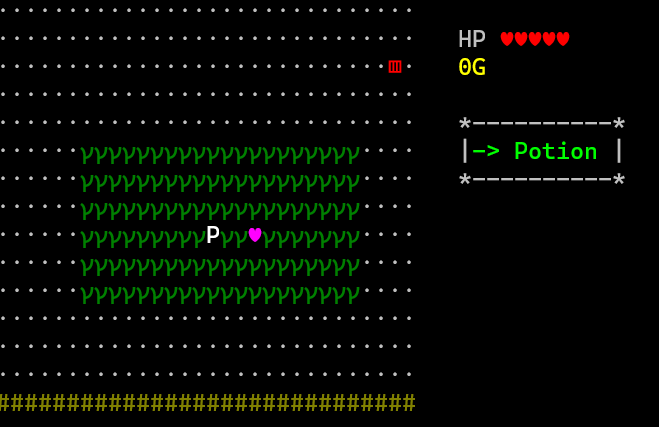

### 🪙 골드
- 골드를 획득하면 1G를 획득한다.  
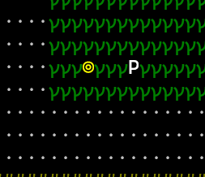

### ☠️ 던전
- 던전 입구에 들어가면 전투를 시작한다.  
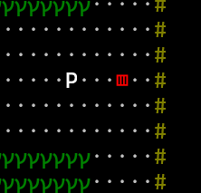

 

## ⚔️ 전투 진행 방식
- 3종류의 몬스터 중 하나가 선택되며 전투가 시작된다.
  - 몬스터는 종류별로 체력과 스킬 데미지가 다르다.
- 전투를 시작하면 수행할 행동을 선택한다.
  - 플레이어는 직접 선택하고, 몬스터는 랜덤으로 지정된다.  
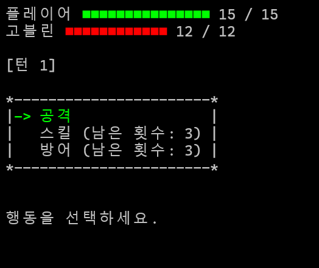

### 👊 공격
- 일반 공격을 선택하면 상대에게 `1 Damage`를 가한다.
- 몬스터도 종류와 상관없이 동일하게 `1 Damage`를 가한다.  
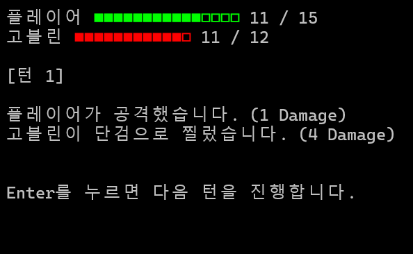

### 🪄 스킬
- 플레이어와 몬스터는 전투당 스킬을 최대 **3번** 사용할 수 있다.
- 스킬 공격을 하면 상대에게 `3 Damage`를 가한다.
- 몬스터는 종류에 따라 `3 / 4 / 5 Damage`를 가한다.  
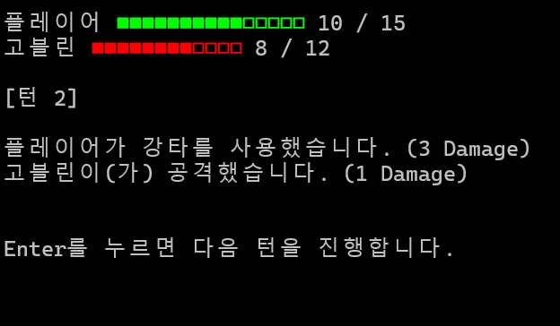

### 🛡️ 방어
- 플레이어와 몬스터는 전투당 방어를 최대 **3번** 사용할 수 있다.
- 방어를 사용하면 해당 턴에 받는 데미지가 0이 된다.
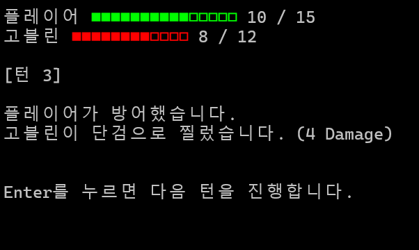

### 게임 결과
#### 😀 승리
- 전투에서 승리하면 5G를 획득하고 마을로 돌아간다.  
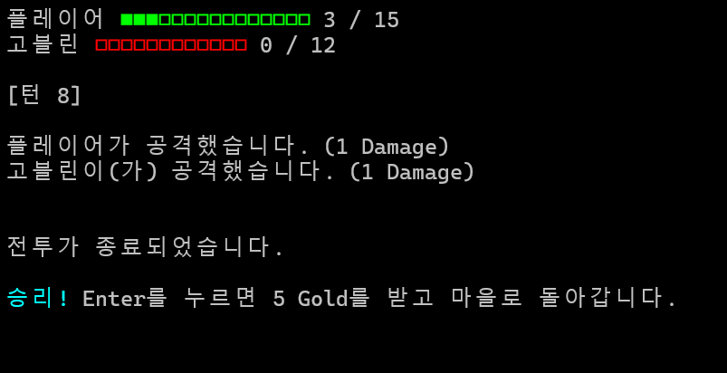

#### 🤝 무승부
- 전투에서 무승부일 경우 보상이나 페널티 없이 마을로 돌아간다.  
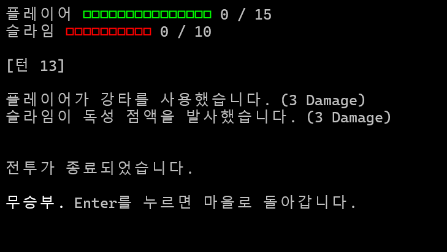

#### 😵 패배
- 전투에서 패배하면 ♥가 1 감소하며 마을로 돌아간다.
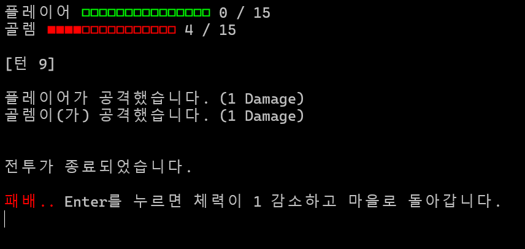

- ♥가 모두 소모되면 종료 화면으로 이동한다.  
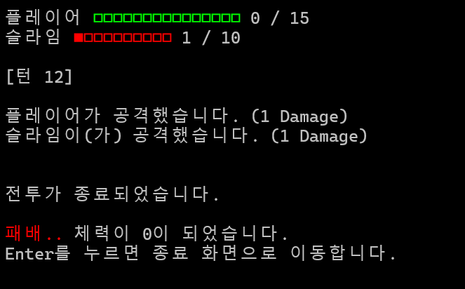 
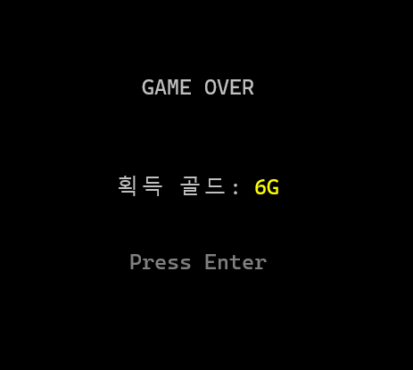